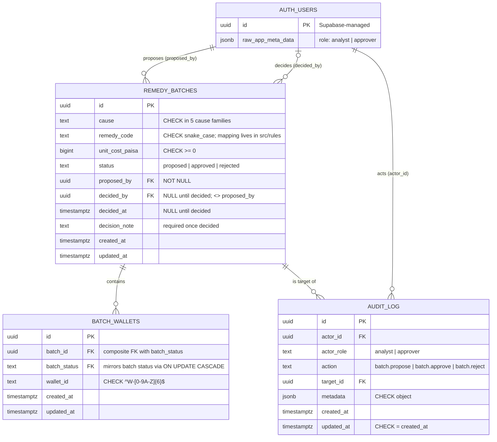

# WhyQuiet — Database Schema (DRAFT, not applied)

> Status: **PROPOSAL (D15)**. Nothing here has been migrated. To apply, copy the SQL into
> `supabase migration new remedy_batches` after review.
> Source: `docs/system-design.md` (FR-6, FR-7, FR-9, FR-10, FR-11), D12b, D13b, D14.

## Scope: what lives in Postgres, and what doesn't

Read paths (queue, wallet detail, refusals, money report) are served from bundled seed data (D6, D12b),
so **Postgres holds only the write path**: batch proposals, their wallets, and the audit trail.

| Requirement asked for | What this draft does | Why |
| --- | --- | --- |
| Multi-tenant `organization_id` everywhere | **Not added** | system-design §2 says single tenant, §6 puts multi-tenancy out of scope (D13). The user chose single tenant. |
| `id` UUID, `created_at`, `updated_at` on every table | Done | `audit_log.updated_at` is CHECKed equal to `created_at`, because rows never change. |
| Soft deletes where recovery matters | **None** | Nothing in the design deletes data. Batches end as `rejected`, not deleted. The audit log is immutable (FR-9). DELETE is blocked by triggers, so no data can be lost and nothing needs recovering. |
| FK and filter/sort indexes | Done | See the index section. |
| Constraints in the DB | Done | Enums, the two-person rule, the decision shape, wallet ID format, and one open batch per wallet are CHECK/UNIQUE constraints. Rules that span rows or depend on state transitions are triggers. |
| Money as integer minor units | `unit_cost_paisa bigint` | Single currency (BDT, ASSUMED). Batch total = `unit_cost_paisa × count(batch_wallets)`. Once a batch is decided, its wallets are frozen, so this total cannot drift. |
| Users / roles table | **None**, FKs to Supabase `auth.users` | Roles live in JWT `app_metadata` (system-design §2). A profiles table would just duplicate them. |
| Export table | **None** | FR-7 payload is derived on demand from an approved batch + its wallets. |

Cause codes (`job_exit`, `migration`, `solved_problem`, `fee_shock`, `supply_failure`) are **ASSUMED**.
No code defines them yet. `src/rules` must use the same strings.

## 1. ERD



The existing `public.triage_audit_log` (migration `20261003180000`) is not part of this design and is
left untouched. Its columns are all nullable and it has no `updated_at`. Tightening it would be a
separate migration, if someone wants it.

## 2. Schema (Postgres SQL, Supabase migration style)

The project has no ORM ("ORM: None (Supabase Python client)"), so the schema format is plain SQL.

```sql
-- ── shared trigger functions ───────────────────────────────────────────────
create function public.set_updated_at() returns trigger
language plpgsql set search_path = '' as $$
begin
  new.updated_at := now();
  return new;
end $$;

create function public.forbid_change() returns trigger
language plpgsql set search_path = '' as $$
begin
  raise exception '% on %.% is not allowed', tg_op, tg_table_schema, tg_table_name;
end $$;

-- ── remedy_batches ─────────────────────────────────────────────────────────
create table public.remedy_batches (
  id              uuid primary key default gen_random_uuid(),
  cause           text not null
                  check (cause in ('job_exit','migration','solved_problem','fee_shock','supply_failure')),
  remedy_code     text not null check (remedy_code ~ '^[a-z][a-z0-9_]{1,63}$'),
  unit_cost_paisa bigint not null check (unit_cost_paisa >= 0),
  status          text not null default 'proposed'
                  check (status in ('proposed','approved','rejected')),
  proposed_by     uuid not null references auth.users (id) on delete restrict,
  decided_by      uuid references auth.users (id) on delete restrict,
  decided_at      timestamptz,
  decision_note   text,
  created_at      timestamptz not null default now(),
  updated_at      timestamptz not null default now(),

  -- FR-10 two-person rule
  constraint remedy_batches_two_person check (decided_by <> proposed_by),
  -- decision fields are all-null while proposed, all-present once decided
  constraint remedy_batches_decision_shape check (
    (status = 'proposed' and decided_by is null and decided_at is null and decision_note is null)
    or
    (status <> 'proposed' and decided_by is not null and decided_at is not null
       and length(btrim(decision_note)) > 0)
  ),
  constraint remedy_batches_decided_after_created check (decided_at >= created_at),
  -- target for batch_wallets' composite FK (lets the child mirror status)
  constraint remedy_batches_id_status_key unique (id, status)
);

-- FR-6: proposed -> approved | rejected, once. Only decision fields may change.
create function public.lock_decided_batch() returns trigger
language plpgsql set search_path = '' as $$
begin
  if old.status <> 'proposed' then
    raise exception 'batch % is already %', old.id, old.status;
  end if;
  if (new.cause, new.remedy_code, new.unit_cost_paisa, new.proposed_by, new.created_at)
     is distinct from
     (old.cause, old.remedy_code, old.unit_cost_paisa, old.proposed_by, old.created_at) then
    raise exception 'only the decision fields of batch % may change', old.id;
  end if;
  return new;
end $$;

create trigger remedy_batches_lock      before update on public.remedy_batches
  for each row execute function public.lock_decided_batch();
create trigger remedy_batches_updated_at before update on public.remedy_batches
  for each row execute function public.set_updated_at();
create trigger remedy_batches_no_delete before delete on public.remedy_batches
  for each row execute function public.forbid_change();

create index remedy_batches_status_created_at_idx
  on public.remedy_batches (status, created_at desc);
create index remedy_batches_proposed_by_created_at_idx
  on public.remedy_batches (proposed_by, created_at desc);
create index remedy_batches_decided_by_idx
  on public.remedy_batches (decided_by) where decided_by is not null;

-- ── batch_wallets ──────────────────────────────────────────────────────────
create table public.batch_wallets (
  id           uuid primary key default gen_random_uuid(),
  batch_id     uuid not null,
  batch_status text not null default 'proposed',
  wallet_id    text not null check (wallet_id ~ '^W-[0-9A-Z]{6}$'),   -- FR-11 pseudonymous only
  created_at   timestamptz not null default now(),
  updated_at   timestamptz not null default now(),

  constraint batch_wallets_batch_fk foreign key (batch_id, batch_status)
    references public.remedy_batches (id, status) on update cascade on delete restrict,
  constraint batch_wallets_batch_wallet_key unique (batch_id, wallet_id)
);

-- FR-6: a wallet may be in at most one open (proposed) batch
create unique index batch_wallets_one_open_batch_idx
  on public.batch_wallets (wallet_id) where batch_status = 'proposed';

-- Wallets can only be added or removed while the batch is proposed. Only the
-- cascaded batch_status may change on an existing row.
create function public.guard_batch_wallets() returns trigger
language plpgsql set search_path = '' as $$
begin
  if tg_op = 'UPDATE' then
    if (new.batch_id, new.wallet_id, new.created_at)
       is distinct from (old.batch_id, old.wallet_id, old.created_at) then
      raise exception 'batch_wallets rows are immutable';
    end if;
    return new;
  elsif tg_op = 'DELETE' then
    if old.batch_status <> 'proposed' then
      raise exception 'batch % is %, its wallets are frozen', old.batch_id, old.batch_status;
    end if;
    return old;
  else
    if new.batch_status <> 'proposed' then
      raise exception 'batch % is %, its wallets are frozen', new.batch_id, new.batch_status;
    end if;
    return new;
  end if;
end $$;

create trigger batch_wallets_guard before insert or update or delete on public.batch_wallets
  for each row execute function public.guard_batch_wallets();
create trigger batch_wallets_updated_at before update on public.batch_wallets
  for each row execute function public.set_updated_at();

-- ── audit_log (FR-9, append-only) ──────────────────────────────────────────
create table public.audit_log (
  id         uuid primary key default gen_random_uuid(),
  actor_id   uuid not null references auth.users (id) on delete restrict,
  actor_role text not null check (actor_role in ('analyst','approver')),
  action     text not null check (action in ('batch.propose','batch.approve','batch.reject')),
  target_id  uuid not null references public.remedy_batches (id) on delete restrict,
  metadata   jsonb not null default '{}'::jsonb check (jsonb_typeof(metadata) = 'object'),
  created_at timestamptz not null default now(),
  updated_at timestamptz not null default now(),

  constraint audit_log_role_matches_action check (
    (action = 'batch.propose' and actor_role = 'analyst')
    or (action in ('batch.approve','batch.reject') and actor_role = 'approver')
  ),
  constraint audit_log_never_updated check (updated_at = created_at)
);

create trigger audit_log_no_update_delete before update or delete on public.audit_log
  for each row execute function public.forbid_change();
create trigger audit_log_no_truncate before truncate on public.audit_log
  for each statement execute function public.forbid_change();

create index audit_log_target_id_created_at_idx on public.audit_log (target_id, created_at);
create index audit_log_actor_id_created_at_idx  on public.audit_log (actor_id, created_at desc);

-- ── access ─────────────────────────────────────────────────────────────────
-- Only the FastAPI backend touches these tables, using the service role (src/api/store.py),
-- which bypasses RLS. RLS on with no policies = anon/authenticated clients get nothing.
alter table public.remedy_batches enable row level security;
alter table public.batch_wallets  enable row level security;
alter table public.audit_log      enable row level security;
```

### Known gaps (accepted, stated rather than hidden)

- **Empty batch:** the DB does not force a batch to have at least one wallet. That would need a
  deferred constraint trigger. An empty batch costs 0 paisa, so approving one does no harm.
- **Triggers are the only hard guard.** They still fire for the service role, so the backend can't
  get around them. A superuser who sets `session_replication_role = replica` can.
- **Role claims are not verified in SQL.** `actor_role` is checked against `action`, but whether the
  actor really holds that role comes from the JWT, which the backend verifies (system-design §2).

## 3. Index explanations

| # | Index | Columns | Serves |
| --- | --- | --- | --- |
| 1 | `remedy_batches_pkey` | `(id)` | Implicit PK. Fetches a batch by ID for detail, approve, and export. |
| 2 | `remedy_batches_id_status_key` | `(id, status)` UNIQUE | Required as the target of `batch_wallets`' composite FK. Postgres only lets an FK reference a unique key. |
| 3 | `remedy_batches_status_created_at_idx` | `(status, created_at desc)` | Approver queue: `where status = 'proposed' order by created_at desc`. Also history lists filtered to approved or rejected. |
| 4 | `remedy_batches_proposed_by_created_at_idx` | `(proposed_by, created_at desc)` | FK index for `proposed_by`, so a `delete from auth.users` RESTRICT check doesn't scan the table. Also serves the analyst's "my proposals, newest first". |
| 5 | `remedy_batches_decided_by_idx` | `(decided_by) where decided_by is not null` | FK index for `decided_by`. Partial, because every open batch has NULL there. |
| 6 | `batch_wallets_pkey` | `(id)` | Implicit PK. |
| 7 | `batch_wallets_batch_wallet_key` | `(batch_id, wallet_id)` UNIQUE | Stops the same wallet appearing twice in one batch. Because it leads with `batch_id`, it also covers the composite FK `(batch_id, batch_status)`, which matters when an approval cascades the new status to child rows. It also serves "list wallets in batch X" for the approver review and the export. A separate FK index would be redundant. |
| 8 | `batch_wallets_one_open_batch_idx` | `(wallet_id) where batch_status = 'proposed'` UNIQUE | Enforces FR-6 (one open batch per wallet) in the DB. Also answers "is W-XXXXXX already in an open batch?" when an analyst proposes. It only covers open rows, so decided history doesn't make it bigger. |
| 9 | `audit_log_pkey` | `(id)` | Implicit PK. |
| 10 | `audit_log_target_id_created_at_idx` | `(target_id, created_at)` | FK index for `target_id`, plus the batch timeline (`where target_id = $1 order by created_at`). |
| 11 | `audit_log_actor_id_created_at_idx` | `(actor_id, created_at desc)` | FK index for `actor_id` (auth-user delete RESTRICT check), plus "actions by this person, newest first". |

**Deliberately not indexed:**
- `remedy_batches.cause`: no screen filters batches by cause. The cause filter in the design is on the triage queue, which is served from seed data, not Postgres.
- `batch_wallets.wallet_id` for decided rows: no flow looks up a wallet's past batches.
- `audit_log.metadata`: free-form, never filtered.
